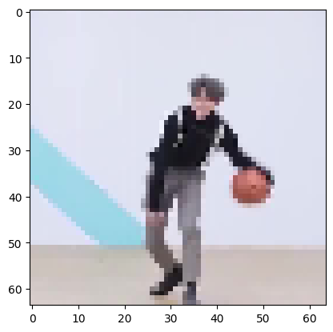

# Super-Resolution WGAN for Low-Resolution Images and GIFs
(Final Project for DeepLearning 2470 @Brown)

Implemented on `Python3.10` and `Tensorflow2.12.0`. Dataset: DIV2K

### Required Packages
- For training: `tensorflow`, (`IPython`, `PILLOW`, `matplotlib` if using the `utils.CallBack` module)
    - *If using different pretrained model for Generator's Content Loss, `GluonCV` is recommended*
- For testing: `tensorflow`, `matplotlib`, (`imageio` and `pygifsicle` for GIFs)

### Reproduction
#### Training
**Sample SLURM script file is included in the project as `srwgan_train.sh`**
```
python3 train_SRWGAN.py --trainnum 600 --epochs 40 --batchsz 4 --gpweight 16.0 --cweight 4 --savemodel True
```

#### Testing
**All available APIs are included under `utils.testGenerate`, and will be updated**
- A pretrained Generator is included in `./SRWGAN_Gen`
- Sample testing codes on images and GIFs are included in the project as `testGenerator.py` with relatively detailed comments. Change the code as needed.

### Reach Goals
- Adding support for videos
- Incorporate non-gradient-descent methods, such as Optimal Transport Theory (Sinkhorn Algorithm implemented and included under `./utils/`) into the model.
- Adding Attention Mechanism or making it a conditioned model (Reference: Consistent Model)
- Further investigating the differences of Diffusion Model and GAN models in AIGC or Super-Resolution Task
- Image or Image size agnostic SR model
- Reinforcement Learning as the primary design for Meta Learning on GAN models 

### Disclaimer
*You may want to take off your glasses, squint your eyes or take a few steps backwards when looking at the sample results*

### Sample Testing Results (Preliminarily pre-trained generator for 100 epochs on 800 images from DIV2K)


|Low-Resolution Image | Generated Super-Resolution Image|
|:---:|:---:|
| ||


|Low-Resolution GIF | Generated Super-Resolution GIF|
|:---:|:---:|
| | | 

