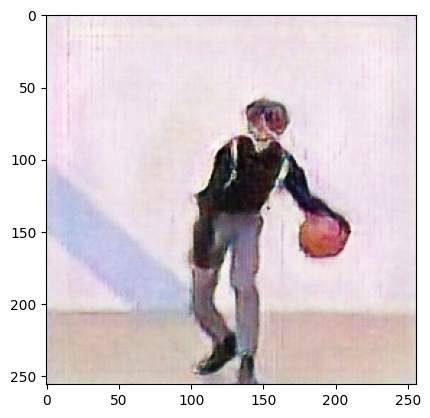
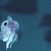
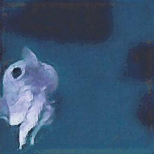

# Super-Resolution WGAN for Low-Resolution Images and GIFs
(Final Project for DeepLearning 2470 @Brown)

Implemented on `Python3.10` and `Tensorflow2.12.0`. Dataset: DIV2K

**(CUDA11.8 and CuDNN8.7.0 if using GPU/TPU)** 

### Required Packages
- For training: `tensorflow`, (`IPython`, `PILLOW`, `matplotlib` if using the `utils.CallBack` module)
    - *If using different pretrained model for Generator's Content Loss, `GluonCV` is recommended*
- For testing: `tensorflow`, `matplotlib`, (`imageio` and `pygifsicle` for GIFs)

### Reproduction
*Should work for any dataset where the original images are larger than or equal to 256x256x*

#### Training
**Sample SLURM script file is included in the project as `srwgan_train.sh`**
```
python3 train_SRWGAN.py --trainnum 600 --epochs 40 --batchsz 4 --gpweight 16.0 --cweight 4 --savemodel True
```

#### Testing
**All available utilities/subroutines for testing are included under `utils.testGenerate`, and will be updated**
- A pretrained Generator is included in `./SRWGAN_Gen`
- Sample testing codes on images and GIFs are included in the project as `testGenerator.py` with relatively detailed comments. Change the code as needed.


### Methods
1. Data PreProcessing:
    - High-Res images are randomly cropped from the original images in the dataset into 256x256 images
    - Low-Res images are generated by naively downscaling the processed High-Res images
2. Architecture:
    1. Discriminator: Regular Convolutional Blocks
    2. Generator: Regular Convolutional Blocks + Super-Pixel Upsampling Blocks (to increase the sharpness rather than the smoothness in the generated images)
3. Loss Function Designs:  WGAN-GP (Wasserstein GAN with Gradient Penalty) is the primary framework adopted, but with an extra **ContentLoss**, thus the `total_loss` consists of:
    1. Discriminator:
        - Wasserstein Distance in the Discriminator's Latent Space between the generated Super-Res (Fake) and the High-Res (Real) images (because the Discriminator wants to minimize/suppress the fake images while maximize/promote the real images)
        - Gradient Penalty term as the Lipschitz Constraint for stable trainings: Gradients of the Discriminator's prediction of interpolated inputs (Gaussian Diffusion of the Super-Res(Fake) and the High-Res(Real)), w.r.t. the inputs, i.e. the interpolated inputs.
    2. Generator:
        - Wasserstein Distance in the Discriminator's Latent Space between the origin and the generated Super-Res (Fake) images (because the Generator wants to maximize/promote its generated fake images)
        - Reconstruction Loss (MSE loss between the generated Super-Res fake images and the ground-truth High-Res real images): thus the PSNR metric is useless here.
        - Content Loss (MSE loss between the hyperpixels of the generated Super-Res fake images and the ground-truth High-Res real images): the hyperpixels of an image is constructed by stacking the intermediate output feature maps from a pretrained model. By default, in this project, outputs at layer 2, 7, 10, 14 (Reference: Class-Activation Map) of a pretrained ResNet50 are chosen for hyperpixels. For adavanced pretrained models refer to `GluonCV`.

*Weights for all the loss terms are still yet to be determined for the best results*

*For testing on GIFs, the provided utilities have already taken into account possible long GIFs, thus should be able to handle them without OOM*

### Reach Goals
- Adding support for videos
- Adding noises or other complicated downscaling methods in data preprocessing to incease the model's robustness and generalizability.
- Consider frequency domain upsampling methods (e.g. Fourier Transform)
- Adding user-friendly interface for testing trained Generators on images and GIFs.
- Adding [Self-Adaptive Weights](https://github.com/levimcclenny/SA-PINNs) for the different loss terms
- Incorporate non-gradient-descent methods, such as Optimal Transport Theory (Sinkhorn Algorithm implemented and included under `./utils/`) into the model.
- Adding Attention Mechanism or making it a conditioned model (Reference: Consistency Model)
- Further investigating the differences of Diffusion Model and GAN models in AIGC or Super-Resolution Task
- Image or Image size agnostic SR model
- Reinforcement Learning as the primary design for Meta Learning on GAN models 

### Disclaimer
*You may want to take off your glasses, squint your eyes or take a few steps backwards when looking at the sample results*

### Sample Testing Results (Preliminarily pre-trained generator for 100 epochs on 800 images from DIV2K)


|Low-Resolution Image | Generated Super-Resolution Image|
|:---:|:---:|
| ||


|Low-Resolution GIF | Generated Super-Resolution GIF|
|:---:|:---:|
| | | 

